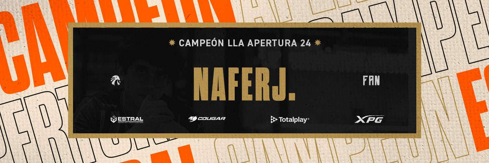

<!-- Banner principal (puedes cambiar la imagen cuando quieras) -->

  

[//]: # (<h2 align="center">NaferJ</h2>)

  <b>Desarrollador Full Stack</b>  
  JavaScript · PHP · SQL · React · Laravel · Node.js

  
  
  
  
  
  
  
  
  

  <kbd>💻 Proyectos privados para empresas</kbd> &nbsp; | &nbsp;
  <kbd>🚀 Aprendiendo React y Laravel</kbd>

  <kbd>🤝 Startup en formación (grupo de programadores)</kbd>

  <kbd>🎯 Explorador de nuevas tecnologías y herramientas</kbd>

  
   
  Cuenta personal

<!-- Puedes agregar una breve bio aquí si lo deseas -->
<!--

  <i>Aquí va tu biografía...</i>

-->
